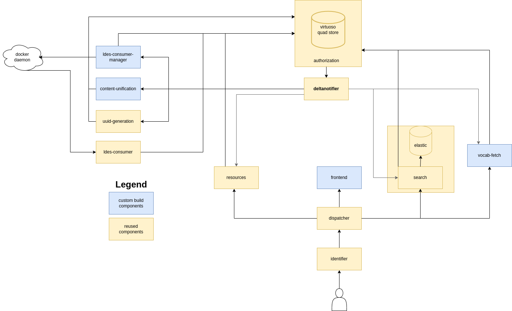

# Linked Data VocabTerms Lookup Service
Vocabserver is a tool to make it easier to use existing vocabularies within your organization. 

The aim of this project is to provide a service that allows 
 - to add selected existing vocabularies and glossaries by reference (ingest & sync) 
 - allow adding translations to the vocabularies where necessary
 - Access the harvested content to terms via a fast lookup API solution (full-text search on labels and filters on categories)
 - the service is integratable in various applications via a [reusable lookup widgets](https://github.com/vlizBE/vocabserver-webcomponent)


## Code
This repository hosts the code and configurations for the backend of vocabsearch.

Related repositories are:

- [vocabserver-frontend](https://github.com/vlizBE/vocabserver-frontend/) hosting the code of the admin frontend
- [vocabserver-webcomponent](https://github.com/vlizBE/vocabserver-webcomponent) hosting the code of a webcomponent that can connect with this backend

A demo is currently available on https://vocabsearch.redpencil.io/ . 


## Setting up the backend

### Prerequisites
The backend was tested on ubuntu 20.04 and requires both docker and docker-compose to be installed.

This can be done with the following script:

NOTE: as of June 2023 `docker-compose` is deprecated and replaced by the `docker compose` command that is now part of docker. The steps for docker-compose in the script below can be skipped.


```sh
# update system
apt update > /dev/null &&  apt upgrade -y

# docker
apt install -y apt-transport-https ca-certificates curl software-properties-common
curl -fsSL https://download.docker.com/linux/ubuntu/gpg |  apt-key add -
add-apt-repository \
     "deb [arch=amd64] https://download.docker.com/linux/ubuntu \
   $(lsb_release -cs) \
   stable"
apt update > /dev/null
apt -y install docker-ce
docker run --rm hello-world

# docker-compose
curl -L https://github.com/docker/compose/releases/download/1.28.2/docker-compose-$(uname -s)-$(uname -m) -o /usr/local/bin/docker-compose
curl -L https://raw.githubusercontent.com/docker/compose/1.28.2/contrib/completion/bash/docker-compose -o /etc/bash_completion.d/docker-compose
chmod +x /usr/local/bin/docker-compose

# dr and drc auto completion
echo "complete -F _docker_compose drc" >> /etc/bash_completion.d/docker-compose
echo "complete -F _docker dr" >> /usr/share/bash-completion/completions/docker
```

### installation of the backend
```sh
  # clone the repository
  git clone https://github.com/vlizBE/vocabserver-app.git
  # start the backend
  cd vocabsearch-app
  docker-compose up
```

### configuration and reverse proxy
By default the backend will expose no ports on the docker host, if you want you can add a port mapping to the identifer to expose the backend service and admin interface. See the [docker-compose.dev.yml](https://github.com/vlizBE/vocabserver-app/blob/415a7d4ded4b391f6fc50a07b24230b9b9a19f70/docker-compose.dev.yml#L6) file for an example on how to do this.

For production use it's recommend to place the backend behind a reverse proxy, so only the search API is exposed publicly.
Assuming the following port mapping has been added to the identifier:
```yml
ports:
 - 127.0.0.1:8888:80
```

You could use the following nginx config to serve as a reverse proxy:

```
server {
    server_name my.vocabsearch.domain {
      location /concepts/search {
        proxy_pass http://localhost:8888;  
      }
}
```

## updating the application
Updating typically involves the following steps:

1. `git pull` the update the repository on the server
2. `docker compose build` to (re)build the services that are part of this repository
3. `docker compose down` stop and remove all existing services (and their ephimeral state)
4. `docker compose up -d`  create and start all services in detached mode


## resetting the application
In some cases it can be useful to fully reset the application. This can easily be done with the following steps:

1. `docker compose down` stop and remove all existing services (and their ephimeral state)
2. `rm -rf ./data` remove all state
3. `git checkout ./data` restore initial state from repository
4. `docker compose up -d` create and start all services in detached mode

## Service overview


### Resources
Repository: https://github.com/mu-semtech/mu-cl-resources/

mu-cl-resources provides a JSONAPI compatible interface to the content specified in the configuration. Most configuration occurs in the `config/resources/domain.json` or `config/resources/domain.lisp` file (your choice). Main service for accessing and updating information in the QUAD store.

### Search
Repositories:
  - https://github.com/mu-semtech/mu-search/
  - https://github.com/mu-semtech/mu-search-elastic-backend

A component to integrate authorization-aware full-text search into a semantic.works stack using Elasticsearch.
This component picks up any (relevant) changes to the RDF store and applies them to elasticsearch. The config can be found in `./config/search/config.json`


### Deltanotifier
Repository: https://github.com/mu-semtech/delta-notifier/
Receives updates from the database (via the authorization layer) and forwards them to relevant services based on it's configuration.


### Authorization
Repository: https://github.com/mu-semtech/mu-authorization/

The SPARQL endpoint authorization service (SEAS) is a layer that is placed in front of a SPARQL endpoint and that rewrites queries on this endpoint based on the session information of the user and the access rights on the data.

The idea is that data is organized into graphs and the access to these graphs is restricted to a certain set of roles. Each set of roles is associated with a group. When an INSERT query is sent to the SPARQL endpoint it is intercepted by SEAS. SEAS then loops through its different group specifications and, per specification, distributes the triples across different graphs when they match the graph's constraint. When a service later tries to read data through SEAS, the session is examined and the access criterion of every group is evaluated. If the user has access to the group, the service is allowed to read from the group's graph.

### Dispatcher
Repository: https://github.com/mu-semtech/mu-identifier
Core microservice for dispatching requests to the preferred microservice.
The mu-dispatcher is one of the core elements in the semantic.works architecture. This service will dispatch requests to other microservices based on the incoming request path. You can run the service through docker, but you probably want to configure it using mu-project so it uses your own configuration.

### Identifier
Repository: https://github.com/mu-semtech/mu-dispatcher
An HTTP proxy for identifying sessions so microservices can act on them.

The mu-identifier doesn't have much information on the user's session. It identifies a specific Browser Agent (a specific browser on a specific device) so other services can attach information to them. The session identifier is passed through the MU-SESSION-ID header to the backend services. The identifier is also responsible for other things in which we detect the user, currently caching the access rights of the current user.

### uuid-generation
Repository: https://github.com/kanselarij-vlaanderen/uuid-generation-service

Data used within a semantic.works-stack (and mu-cl-resources in particular) requires each RDF-object to have a mu:uuid property. Data imported from third parties might not have this uuid. Thus, in order to integrate with other sources while harnessing the power of semantic.works, uuid's need to be added to each imported object. This service does exactly that.

### vocab-fetch
Responsible for downloading and analyzing vocabularies. Part of this repository, can be found under `services/vocab-fetch`.

### content-unification
Transforms a downloaded vocabulary to a harmonized model so it can be index by mu-search. Part of this repository, can be found under `services/content-unification`.

### ldes-consumer-manager
Repository: https://github.com/redpencilio/ldes-consumer-manager/

This service provides an interface to manage ldes-consumer-service containers. It has direct access to the docker daemon, so do not expose it to the world.

### ldes-consumer
Repository: https://github.com/redpencilio/ldes-consumer-service/

This service uses a consumer (based on https://github.com/TREEcg/event-stream-client/tree/main/packages/actor-init-ldes-client) to fetch new versions of resources (members) from an (time-based) LDES stream. You can learn more about LDES at https://semiceu.github.io/LinkedDataEventStreams/.
NOTE: in this stack these containers are managed by the ldes-consumer-manager.

## monitoring and logging
#### Finding out which service returned an error
`./config/dispatcher/dispatcher.ex` has the dispatcher configuration. The dispatcher forwards requests to specific services. Find out to which service your request was forwarded and check the logs of the specific service.

#### Unification has finished but the vocabulary is not showing up in the search
After the unification step, the data has been transformed to a harmonized model and stored in the RDF store. this inertion is picked up by musearch, but these changes still need to be persisted into elasticsearch.

You can follow this process by monitoring the logs of search. The following command will give you the last 100 lines of the log and start following from there:  `docker compose logs -ft --tail 100 search`.

Look out for the following message:
```
WARN [#38] UPDATE HANDLER -- Large number of updates (24060) in queue```
```

The queue has to be fully processed for the entire vocab to be available in search.

#### Fetching the vocabulary resulted in a failure
Check the logs of the vocab-fetch service for errors : `docker compose logs vocab-fetch | grep -i -A 3 -B 3 ERROR`


#### Analysis of the vocabulary failed
Check the logs of the vocab-fetch service for errors : `docker compose logs vocab-fetch | grep -i -A 3 -B 3 ERROR`
Downloaded files can be found in ./data/vocab-fetch. Verify that the file has the content you expected.

#### Unification of the vocabulary failed
Check the logs of the content-unification service for errors : `docker compose logs content-unification | grep -i -A 3 -B 3 ERROR`

#### failures with LDES sources
The `ldes-consumer-manager` creates new docker containers on the host machine to harvest and process LDES feeds.
You can list all the containers created by the manager using the following command:
```
docker ps -a --filter "io.redpencil.ldes-consumer-manager"
```

You can check the log of the containers with the command `docker logs <container-name>`
